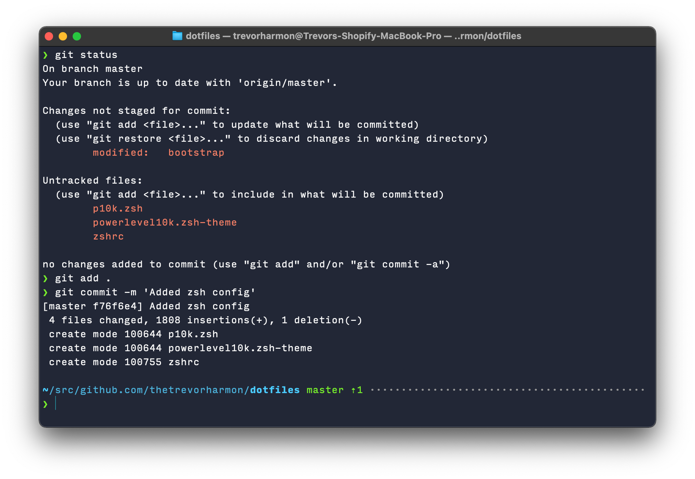

# dotfiles

## Terminal

- [oh-my-zsh](https://ohmyz.sh/)
- [Robby Russell oh-my-zsh theme](https://github.com/ohmyzsh/ohmyzsh/blob/master/themes/robbyrussell.zsh-theme)
- [zsh-autosuggestions](https://github.com/zsh-users/zsh-autosuggestions)
- [Powerlevel10k](https://github.com/romkatv/powerlevel10k)
- [Input Mono](https://input.djr.com/)
- [Smyck color theme](http://color.smyck.org/)

## OS Customizations

- [QLMarkdown](https://github.com/sbarex/QLMarkdown) for markdown quicklook previewing
